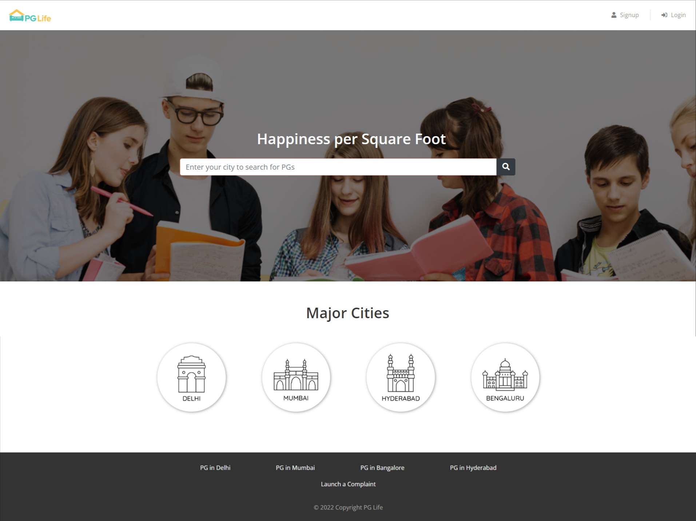
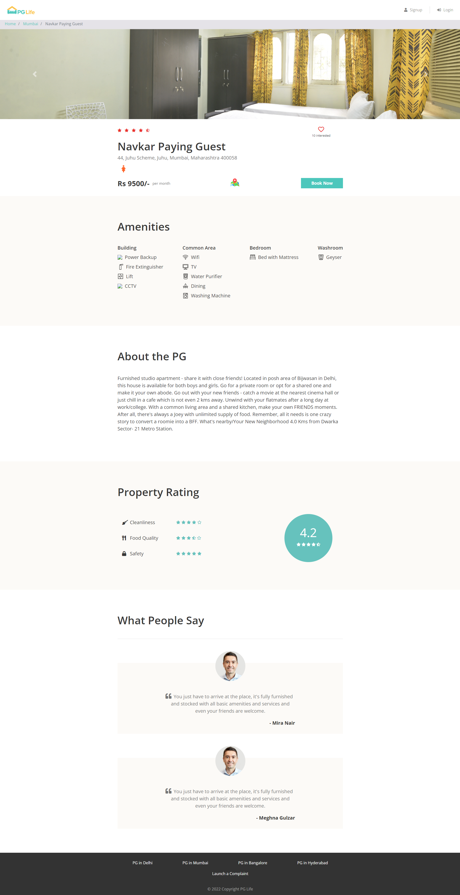
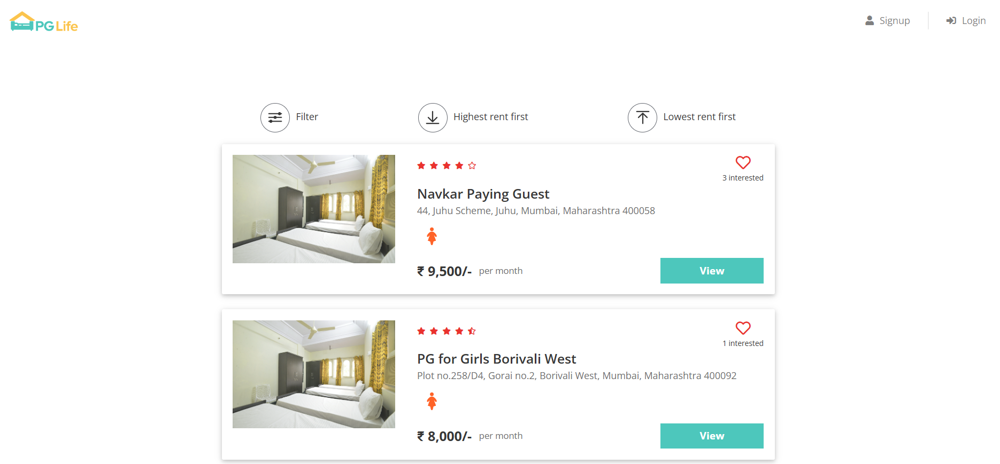
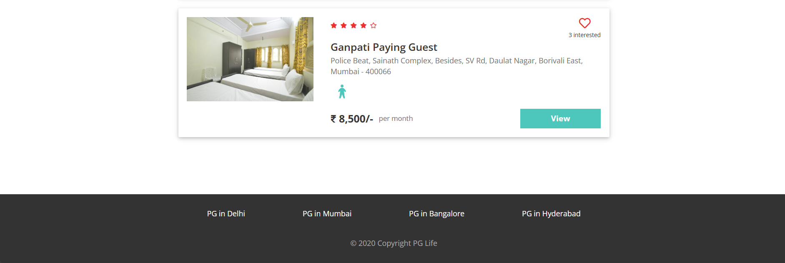

# PG Life 🏠

> Overview➡️
PG Life is a web application that allows users to search for PG accommodations in various cities. The application provides a user-friendly interface to search for PGs by city and displays a list of available PGs in the selected city.
verify:

**(I have tried to host this website in Heroku or Hostinger, as this includes some costing so I was unable to deploy)**


where: Below is the referral URL where you can view the site.

click this :  [PG LIFE](http://debanjansarkar.epizy.com/PGLIFE/index.php )

## Features➡️

- Search for PG accommodations by city
- Display a list of available PGs in the selected city
- User registration and login functionality
- Responsive design for a better user experience

## Directory Structure➡️
- includes/: This directory contains PHP files that are included in the main PHP file. It includes files for head links, header, signup modal, login modal, and footer.
- css/: This directory contains CSS files for styling the application. Currently, it includes a file named home.css.
- img/: This directory contains image files used in the application. Currently, it includes images for Delhi, Mumbai, Bengaluru, and Hyderabad.











  
## Files➡️
- index.php: This is the main PHP file that includes the HTML structure and PHP code for the application.
- head_links.php: This file contains links to external CSS and JavaScript files.

- header.php: This file contains the HTML code for the application's header.
- signup_modal.php: This file contains the HTML code for the signup modal.
- login_modal.php: This file contains the HTML code for the login modal.
- footer.php: This file contains the HTML code for the application's footer.
- home.css: This file contains CSS styles for the application's home page.
delhi.png, mumbai.png, bangalore.png, hyderabad.png: These are image files used in the application.

## Installation➡️
- Create a new directory for the project and add the provided files to it.
- Create a new PHP file named property_list.php to handle the search functionality.
- Update the action attribute in the search form to point to the property_list.php file.
- Configure the application to connect to a database to store user data and PG listings.

## React: 
The JavaScript library for building user interfaces.
## URLSearchParams: 
A utility library for working with URL query parameters.


## Setup
* Clone the repository:

```

git clone https://github.com/suryatapa7/PGLife.git

```

## Database Connectivity:

* Create a database with phpMyAdmin Tool using the same name as the provided SQL file name.
* Import the given SQL file into the created database.
* Update database connectivity:

* In the file includes/database_connect.php, modify the following line:

```

$conn = mysqli_connect("localhost", "username_of_phpmyadmin", "password_of_phpmyadmin", "Database_name(PGLife)");

```

* Replace "username_of_phpmyadmin", "password_of_phpmyadmin", and "Database_name(PGLife)" with your phpMyAdmin credentials and the database name you created.

 ## Technologies Used
* The following technologies were used in developing the PG Life web application:

- HTML
- CSS
- Bootstrap
- JavaScript
- PHP
- MySQL-Database (phpMyAdmin_server)

🙏Thank you!

😊We hope you find PG Life useful. If you have any questions or feedback, please feel free to contact us.